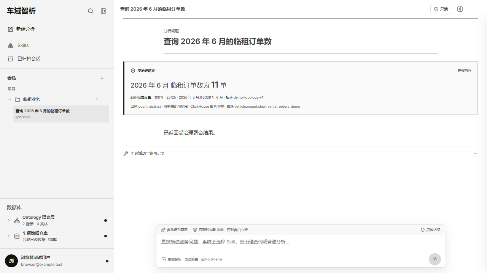
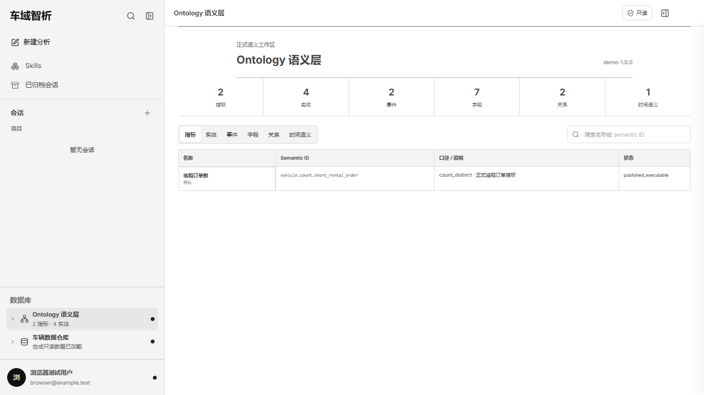
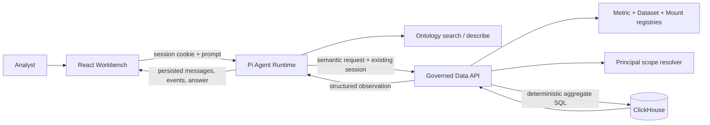

# OntoFleet: Vehicle Ontology Data Agent

[](https://github.com/waawei/vehicle-ontology-data-agent/actions/workflows/ci.yml)
[](LICENSE)

[中文说明](README.zh-CN.md)

OntoFleet is an answer-first vehicle analytics agent built with the Pi Agent
Runtime, a governed vehicle Ontology, deterministic data tools, ClickHouse, and
a React Workbench. The model can reason about a question and select a semantic
tool, but it cannot invent SQL, choose organization IDs, or turn a truncated
page of rows into a company-wide metric.



> Every identity, organization, table, supplier, vehicle, employee, and metric
> value shown in this public repository or its screenshots is synthetic.

## Why this exists

Giving an LLM direct database access creates three avoidable risks: physical
schema guessing, tenant-scope leakage, and incorrect aggregation over sampled
rows. OntoFleet separates responsibilities:

- **Pi Agent** owns threads, turns, intent routing, Skill selection, tool loops,
  recovery, and the natural-language answer.
- **Ontology tools** expose safe semantic discovery without data credentials or
  real organization identifiers.
- **Governed data tools** accept semantic metric IDs, business time, approved
  dimensions, and approved filters only.
- **The data service** resolves the authenticated Principal, expands its
  organization scope, validates formal bindings, and deterministically compiles
  the ClickHouse query.
- **ClickHouse** performs the complete `count_distinct` or grouped aggregation;
  the agent never computes a full metric from paginated detail rows.
- **The Workbench** renders the structured observation as the fact source and
  keeps the model's prose as interpretation.

## Demonstrated workflow

The included synthetic fixture supports this conversation:

1. `查询 2026 年 6 月的临租订单数`
2. `按供应商分组`
3. `和 5 月比较`

For the demo Principal, the governed results are deterministic:

| Query | Expected result |
|---|---:|
| June 2026 short-rental distinct orders | 11 |
| May 2026 short-rental distinct orders | 8 |
| June supplier groups | 5 / 3 / 3 |

The fixture intentionally includes duplicate records and an organization that
is outside the Principal's scope. A raw row count therefore cannot accidentally
produce the expected answer.

## What is implemented

- Browser and TUI clients backed by the same Pi Agent Runtime.
- Automatic intent routing with explicit Skill-loaded and tool-activity events.
- Persistent, Principal-owned threads with rename, pin, archive, restore,
  delete, refresh recovery, and interrupted-run failure recovery.
- `ontology.search` and `ontology.describe` projections for metrics, entities,
  events, fields, relations, and time semantics.
- `vehicle.aggregate` for governed distinct counts by business month.
- `vehicle.compare` for same-metric, same-scope period comparisons.
- Supplier grouping with a bounded result policy and truncation metadata.
- Server-only Metric Definition, field binding, mount, time encoding, and
  Principal organization-scope resolution.
- Chinese business-month compilation, for example `2026-06` to the governed
  source representation `2026年06月`.
- ClickHouse aggregate pushdown through a typed external organization-scope
  table, with no organization IDs embedded in the query text or response.
- Runtime validation of the complete structured observation contract.
- Separate query completeness and organization-attribution data quality.
- A monochrome, resizable, Codex-style analytics Workbench with Skills,
  projects, archived conversations, data sources, identity, and Ontology views.



## Architecture



See [Architecture](docs/architecture.md) for the request contract, execution
sequence, trust boundaries, and generated SQL shape.

## Quick start

### Prerequisites

- Docker Desktop with Docker Compose
- An OpenAI-compatible chat-completions endpoint and a model available through
  that endpoint

### Configure the provider

Create a local `.env` from the checked-in template:

```powershell
Copy-Item .env.example .env
```

On macOS or Linux:

```bash
cp .env.example .env
```

Set these values in `.env`:

```dotenv
PI_AGENT_BASE_URL=https://your-provider.example/v1
PI_AGENT_API_KEY=your-local-secret
PI_AGENT_MODEL_ID=the-model-id-your-provider-exposes
PI_AGENT_MODEL_NAME=Display Name
PI_AGENT_THINKING_LEVEL=high
SESSION_SECRET=replace-with-at-least-32-random-characters
```

The checked-in model ID is an example default, not a guarantee that every
provider exposes that model. Never commit `.env`.

### Run the complete demo

```powershell
docker compose up --build
```

Open [http://127.0.0.1:5180](http://127.0.0.1:5180), create a new analysis, and
ask `查询 2026 年 6 月的临租订单数`. The local demo identity is issued
automatically. The first structured result should be **11 单**.

Services bind as follows:

| Service | Address | Exposure |
|---|---|---|
| Workbench | `http://127.0.0.1:5180` | browser entry |
| Governed Data API | `http://127.0.0.1:8090` | loopback only |
| Pi Agent Runtime | `http://127.0.0.1:8091` | loopback only |
| ClickHouse | internal Compose network | not published to the host |

Stop the stack with `docker compose down`. Add `-v` only when you intentionally
want to remove the synthetic ClickHouse and thread volumes.

## Contracts and security boundary

The model-facing aggregate request contains no physical source or scope:

```json
{
  "metricId": "vehicle.count.short_rental_order",
  "time": { "kind": "business_month", "value": "2026-06" },
  "groupByFieldIds": [],
  "filters": []
}
```

`/auth/me` returns a public Principal summary, never organization IDs. The data
service independently derives effective scope from its authenticated Principal.
Organization grouping and organization filters are rejected, high-cardinality
grouping is disabled until a publication policy exists, and only registry-bound
physical identifiers can enter generated SQL.

Read [Architecture](docs/architecture.md) and [Security policy](SECURITY.md)
before adapting the demo identity or deploying beyond localhost.

## Development checks

```powershell
cd services/data_api
python -m venv .venv
.\.venv\Scripts\python.exe -m pip install -e ".[dev]"
.\.venv\Scripts\ruff.exe check app tests
.\.venv\Scripts\python.exe -m pytest -q

cd ..\pi_agent_runtime
npm ci
npm run check
npm test
npm run build

cd ..\..\apps\workbench
npm ci
npm run typecheck
npm run lint
npm test
npm run build
npm run test:e2e

cd ..\..
npm run scan
```

CI repeats these checks and runs an integration test against a real ClickHouse
service loaded only with the synthetic fixtures.

## Repository layout

| Path | Responsibility |
|---|---|
| `apps/workbench/` | React/Vite answer-first browser UI |
| `services/pi_agent_runtime/` | Pi Agent tool loop, Skills, threads, TUI, recovery |
| `services/data_api/` | Principal boundary and deterministic governed compiler |
| `semantic/` | Synthetic Semantic Index, topology, metrics, and datasets |
| `infra/clickhouse/init/` | Synthetic ClickHouse schema and fixtures |
| `skills/` | Cross-model vehicle-domain execution guidance |
| `docs/` | Architecture and validation methodology |
| `scripts/scan-public.mjs` | Public-release secret and private-binding guard |

## Scope and limitations

- The public registry intentionally contains only two executable metrics:
  short-rental order count and long-rental vehicle count.
- Only equality filters, supplier grouping, and month-over-month comparison are
  published. Raw detail listing, cost analysis, anomaly detection, and arbitrary
  SQL are not implemented.
- Authentication is a local demo adapter. Replace it with a production identity
  provider and server-side organization topology resolver before deployment.
- Thread persistence is local JSON and suits one Runtime replica. A shared,
  transactional store is required for horizontal scaling.
- The provider must support the configured model and OpenAI-compatible
  chat-completions behavior.
- Organization-attribution quality is release metadata with a numerator,
  denominator, time range, and topology version. It is not inferred from a
  single query and is not the same as query completeness.

## Production validation statement

The private source deployment was exercised against an authorized production
ClickHouse environment. Production values, credentials, organization topology,
physical bindings, raw files, and screenshots are deliberately absent here.
The public repository proves the architecture independently with synthetic data
and documents the privacy-preserving verification method in
[Production validation](docs/production-validation.md).

## Portfolio talking points

- Designed a governed data-agent boundary where the LLM selects semantic tools
  while the server owns identity scope, field binding, and deterministic SQL.
- Implemented full ClickHouse `count_distinct` pushdown, business-time
  normalization, structured provenance, and separate data-quality semantics.
- Integrated the public Pi Agent Runtime with persistent conversations,
  tool-event recovery, natural follow-ups, a TUI, and a production-style React
  Workbench.
- Built contract, integration, browser, accessibility, recovery, and public
  release checks around the highest-risk boundaries.

## License

MIT. See [LICENSE](LICENSE) and [Third-party notices](THIRD_PARTY_NOTICES.md).
