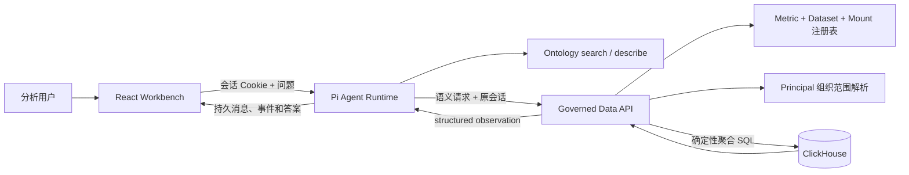

# OntoFleet 车域智析：车辆 Ontology Data Agent

[](https://github.com/waawei/vehicle-ontology-data-agent/actions/workflows/ci.yml)
[](LICENSE)

[English](README.md)

OntoFleet 是一个以最终答案为中心的车辆数据 Agent：Pi Agent Runtime 负责
对话、意图识别、Skill 和工具循环，车辆 Ontology 提供正式业务语义，服务端
受治理工具负责身份范围、字段绑定和确定性 SQL，ClickHouse 负责全量聚合，
React Workbench 负责展示结构化事实与分析结论。


> 本公开仓库及截图中的用户、组织、表、供应商、车辆、员工和指标数值全部为
> 合成演示数据，不包含生产数据或生产物理绑定。

## 要解决的问题

让模型直接连接数据库会带来三个根本风险：猜测物理 schema、越过用户组织
范围、从分页或抽样明细计算“全量”指标。本项目将职责明确拆分：

- **Pi Agent**：管理 thread、turn、意图路由、Skill、工具循环、恢复和自然语言答案。
- **Ontology 工具**：向模型提供安全的指标、实体、事件、字段、关系和时间语义。
- **受治理数据工具**：只接收 metric ID、业务月份、已发布维度和过滤条件。
- **数据服务**：从登录 Principal 解析组织范围，核验 Metric Definition、字段绑定、
  mount 与月份编码，并确定性生成 ClickHouse 查询。
- **ClickHouse**：直接执行完整 `count_distinct` 或分组聚合，不先取 1000 行明细。
- **Workbench**：以 structured observation 为事实来源，模型 Markdown 只承担解释。

## 可复现演示

仓库内的合成数据支持下面这组连续问题：

1. `查询 2026 年 6 月的临租订单数`
2. `按供应商分组`
3. `和 5 月比较`

演示 Principal 对应的确定性结果：

| 问题 | 预期结果 |
|---|---:|
| 2026 年 6 月临租去重订单数 | 11 |
| 2026 年 5 月临租去重订单数 | 8 |
| 2026 年 6 月按供应商分组 | 5 / 3 / 3 |

fixture 特意加入了重复订单和 Principal 范围外组织，因此简单的原始行数统计不会
碰巧得到正确答案。

## 已实现能力

- 浏览器与 TUI 共用同一个 Pi Agent Runtime。
- 自动意图识别，并持久化 Skill 加载与工具活动事件。
- Principal 隔离的持久会话，支持重命名、置顶、归档、恢复、永久删除、刷新恢复，
  服务重启后将未完成 Run 明确恢复为失败。
- `ontology.search` / `ontology.describe` 安全语义投影。
- `vehicle.aggregate`：按业务月份执行受治理去重计数。
- `vehicle.compare`：在同指标、同 Principal 范围、同过滤条件下做月份比较。
- 供应商分组、结果上限、截断状态和结构化 provenance。
- 服务端独占 Metric Definition、Field Binding、mount、时间编码和组织范围解析。
- 将 `2026-06` 按数据集规则编译为 `2026年06月` 等真实源格式。
- 通过 ClickHouse external table 传入组织范围；组织 ID 不进入模型、浏览器响应或 SQL 文本。
- Runtime 对 Python 数据服务返回的完整 observation 合同做二次校验。
- `completeness` 只表达本次查询是否完整；组织归属质量单独位于
  `dataQuality.organizationAttribution`。
- 黑白、可拖动侧栏的分析 Workbench，包含 Skills、项目、归档会话、数据源、账户和
  Ontology 工作区。


## 架构



请求合同、执行时序、信任边界和 SQL 形态见[架构说明](docs/architecture.md)。

## 快速启动

### 前置条件

- Docker Desktop 与 Docker Compose
- 一个 OpenAI-compatible Chat Completions 地址，以及该地址实际可用的模型

### 配置模型 Provider

Windows PowerShell：

```powershell
Copy-Item .env.example .env
```

macOS / Linux：

```bash
cp .env.example .env
```

在本地 `.env` 中填写：

```dotenv
PI_AGENT_BASE_URL=https://your-provider.example/v1
PI_AGENT_API_KEY=your-local-secret
PI_AGENT_MODEL_ID=the-model-id-your-provider-exposes
PI_AGENT_MODEL_NAME=Display Name
PI_AGENT_THINKING_LEVEL=high
SESSION_SECRET=replace-with-at-least-32-random-characters
```

仓库中的默认 model ID 只是配置示例，并不代表每个 Provider 都支持它。不要提交 `.env`。

### 启动完整演示

```powershell
docker compose up --build
```

打开 [http://127.0.0.1:5180](http://127.0.0.1:5180)，新建分析并询问
`查询 2026 年 6 月的临租订单数`。本地演示身份会自动登录，第一条结构化结果应为
**11 单**。

| 服务 | 地址 | 暴露范围 |
|---|---|---|
| Workbench | `http://127.0.0.1:5180` | 浏览器入口 |
| Governed Data API | `http://127.0.0.1:8090` | 仅回环地址 |
| Pi Agent Runtime | `http://127.0.0.1:8091` | 仅回环地址 |
| ClickHouse | Compose 内部网络 | 不发布到宿主机 |

使用 `docker compose down` 停止。只有明确要删除合成数据库和 thread volume 时才加 `-v`。

## 核心合同与安全边界

模型看到的聚合请求不包含物理来源或组织范围：

```json
{
  "metricId": "vehicle.count.short_rental_order",
  "time": { "kind": "business_month", "value": "2026-06" },
  "groupByFieldIds": [],
  "filters": []
}
```

`/auth/me` 只返回公开 Principal 摘要，不返回组织 ID。数据服务用自己的认证上下文
解析有效范围。组织分组和组织过滤会被拒绝；高基数字段在没有发布结果策略前不可
分组；只有注册表绑定并通过 allowlist 的物理标识符才能进入确定性 SQL。

部署到 localhost 之外前，请阅读[架构说明](docs/architecture.md)和
[安全策略](SECURITY.md)。

## 验证

```powershell
cd services/data_api
python -m venv .venv
.\.venv\Scripts\python.exe -m pip install -e ".[dev]"
.\.venv\Scripts\ruff.exe check app tests
.\.venv\Scripts\python.exe -m pytest -q

cd ..\pi_agent_runtime
npm ci
npm run check
npm test
npm run build

cd ..\..\apps\workbench
npm ci
npm run typecheck
npm run lint
npm test
npm run build
npm run test:e2e

cd ..\..
npm run scan
```

CI 还会启动真实 ClickHouse 服务、加载合成 fixture，并验证 11 / 8 / 5-3-3、
Principal 范围过滤和响应中不存在组织 ID。

## 目录

| 路径 | 职责 |
|---|---|
| `apps/workbench/` | React/Vite answer-first 浏览器界面 |
| `services/pi_agent_runtime/` | Pi Agent 工具循环、Skill、thread、TUI 与恢复 |
| `services/data_api/` | Principal 边界与确定性受治理编译器 |
| `semantic/` | 合成 Semantic Index、拓扑、指标和数据集绑定 |
| `infra/clickhouse/init/` | 合成 ClickHouse schema 与 fixture |
| `skills/` | 跨模型车辆领域执行规则 |
| `docs/` | 架构与验证方法 |
| `scripts/scan-public.mjs` | 密钥、私有绑定和禁止文件公开扫描 |

## 当前限制

- 公开注册表只有“临租订单数”和“长租车辆数”两个可执行指标。
- 目前只发布等值过滤、供应商分组和业务月份比较；明细查询、费用、异常检测和任意
  SQL 均未实现。
- 身份模块是本地演示适配器。正式部署必须替换为生产认证与服务端组织拓扑解析器。
- thread 使用本地 JSON，适合单 Runtime 实例；横向扩容需要共享事务存储。
- 模型 Provider 必须真实支持配置的模型及 OpenAI-compatible Chat Completions 行为。
- 组织归属覆盖率是带分子、分母、时间范围和拓扑版本的构建期元数据，不能由一次
  查询推断，也不等同于本次查询的 `completeness`。

## 生产验证说明

私有源系统曾在获得授权的生产 ClickHouse 环境中进行连接和查询验证。生产数值、
凭据、组织拓扑、物理绑定、原始文件和生产截图均未进入本仓库。公开版使用合成数据
独立证明架构，并在[生产验证方法](docs/production-validation.md)中说明如何在不泄露
生产标识和数值的前提下复核。

## 简历表述要点

- 设计模型与数据权限之间的受治理边界：模型选择语义工具，服务端独占 Principal
  范围、字段绑定和确定性 SQL。
- 实现 ClickHouse 全量 `count_distinct` 下推、业务时间归一化、结构化 provenance，
  并拆分查询完整性和组织归属质量。
- 接入公开 Pi Agent Runtime，实现持久会话、工具事件、自然追问、TUI、重启恢复与
  生产风格 React Workbench。
- 围绕高风险边界建设合同、集成、浏览器、可访问性、恢复和公开发布扫描。

## 许可证

MIT，详见 [LICENSE](LICENSE) 与 [Third-party notices](THIRD_PARTY_NOTICES.md)。
