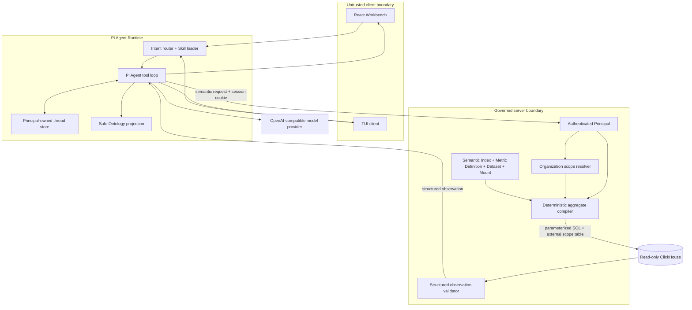
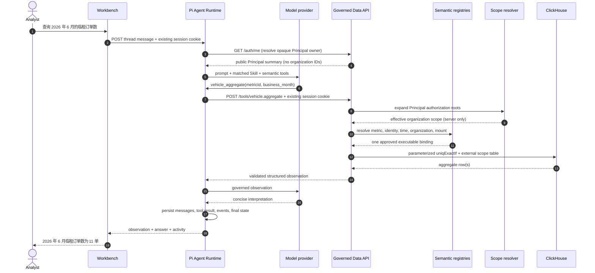

# Architecture

## Design objective

OntoFleet lets an agent reason about vehicle analytics without making the model
the data-governance authority. The model may identify an intent and propose a
semantic operation. Only server code can resolve physical bindings, effective
organization scope, and executable ClickHouse SQL.

## Component view



## Ownership boundaries

| Concern | Owner | Explicitly not owned by |
|---|---|---|
| Thread, turn, tool loop, recovery | Pi Agent Runtime | fixed browser DAG |
| Intent and Skill choice | Pi Agent Runtime | data connector |
| Metric meaning and allowed dimensions | semantic registries | model prompt guesses |
| Physical table and column binding | governed compiler | model or browser |
| Effective organization scope | authenticated server Principal + resolver | request payload |
| SQL text | deterministic compiler | model |
| Full aggregation | ClickHouse | Python over paginated rows |
| Business fact shown to the user | structured observation | Markdown alone |
| Interpretation and explanation | model | ClickHouse connector |

## Request sequence



## Semantic aggregate contract

The request deliberately excludes database, table, column, credentials, tenant,
and organization IDs:

```json
{
  "metricId": "vehicle.count.short_rental_order",
  "time": {
    "kind": "business_month",
    "value": "2026-06"
  },
  "groupByFieldIds": [],
  "filters": []
}
```

The data service returns a typed observation rather than arbitrary connector
JSON:

```json
{
  "metricId": "vehicle.count.short_rental_order",
  "label": "临租订单数",
  "value": 11,
  "unit": "单",
  "time": { "kind": "business_month", "value": "2026-06" },
  "groups": [],
  "completeness": "complete",
  "dataQuality": {
    "organizationAttribution": {
      "status": "measured",
      "coverage": 1.0,
      "numerator": 25,
      "denominator": 25,
      "basis": "metric_identity",
      "timeRange": {
        "kind": "business_month",
        "start": "2026-05",
        "end": "2026-06"
      },
      "topologyVersion": "demo-topology-v1"
    }
  },
  "provenance": {
    "sourceId": "vehicle.mount.short_rental_orders_demo",
    "aggregation": "count_distinct",
    "identityFieldId": "short_rental.order_id",
    "organizationFieldId": "vehicle.dimension.organization",
    "businessTimeFieldId": "vehicle.time.business_month",
    "scope": "principal_organization_scope",
    "pushdown": "clickhouse",
    "sourceTimeCoverage": 1.0,
    "groupResultLimit": null,
    "groupResultTruncated": false
  }
}
```

Pi Runtime validates this entire response before exposing it to the model or
persisting it as a tool result. An HTTP 200 with a partial or malformed body is
not accepted.

## Deterministic compilation

For each request the compiler must resolve exactly one:

1. published, executable Semantic Index metric;
2. approved Metric Definition with a supported aggregation;
3. approved controlled dataset;
4. published read-only ClickHouse mount;
5. identity, organization, and business-time field binding;
6. source-specific business-month encoding;
7. effective Principal scope.

Only identifier values already validated against the mount allowlist are
interpolated into SQL. User values are ClickHouse parameters. Organization
scope is sent as a typed external table, not concatenated into SQL.

The ungrouped query shape is:

```sql
SELECT
  uniqExactIf(
    trimBoth(ifNull(order_id, '')),
    notEmpty(trimBoth(ifNull(order_id, '')))
  ) AS value
FROM vehicle_demo.short_rental_orders
WHERE business_month = {businessMonth:String}
  AND organization_id IN (
    SELECT organizationId FROM scopeOrganizations
  )
FORMAT JSON
```

For the short-rental demo dataset, `{businessMonth:String}` receives
`2026年06月`. There is no detail pagination and no `LIMIT` in an ungrouped
aggregate. Grouped queries use `LIMIT 201` to enforce a published maximum of 200
groups while allowing the service to detect and report truncation.

## Completeness and data quality

`completeness` answers only whether this request completed over the effective
Principal scope and whether the returned aggregate groups were truncated. It
does not claim that every source record has a valid organization attribution.

`dataQuality.organizationAttribution` is separately published dataset metadata.
A measured value requires a numerator, denominator, business-time range, and
organization-topology version produced by a build or validation process. The
service never promotes one successful monthly query into permanent dataset-wide
coverage.

## Thread durability

Each thread persists Pi messages, tool results, bounded activity events, owner,
archive/pin state, and run status. Writes for one thread are serialized. On
startup, a thread left in `running` is converted to `failed` with an explicit
`run_recovered_as_failed` event; the Runtime never presents an interrupted run
as completed.

The local JSON store is intentionally simple for the single-replica demo. A
multi-replica deployment needs shared transactional persistence and distributed
run ownership.

## Published capability surface

| Capability | Public demo status |
|---|---|
| Ontology search and describe | available |
| Short-rental distinct order count | available |
| Long-rental distinct vehicle count | available |
| Supplier grouping | available, max 200 groups |
| Same-metric month comparison | available |
| Organization filter or grouping | forbidden |
| Vehicle/employee high-cardinality grouping | limited, no published policy |
| Raw detail listing | not implemented |
| Cost, contract, anomaly, or risk metrics | not published |
| Model-generated SQL | forbidden |

## Deployment replacements

The Compose stack is a local architecture demo. Before using this design in a
non-local environment, replace the demo session manager and fixed scope resolver,
use read-only ClickHouse credentials, terminate TLS, move secrets to a secret
manager, publish controlled production registries, and replace local thread JSON
when running more than one Runtime replica.
